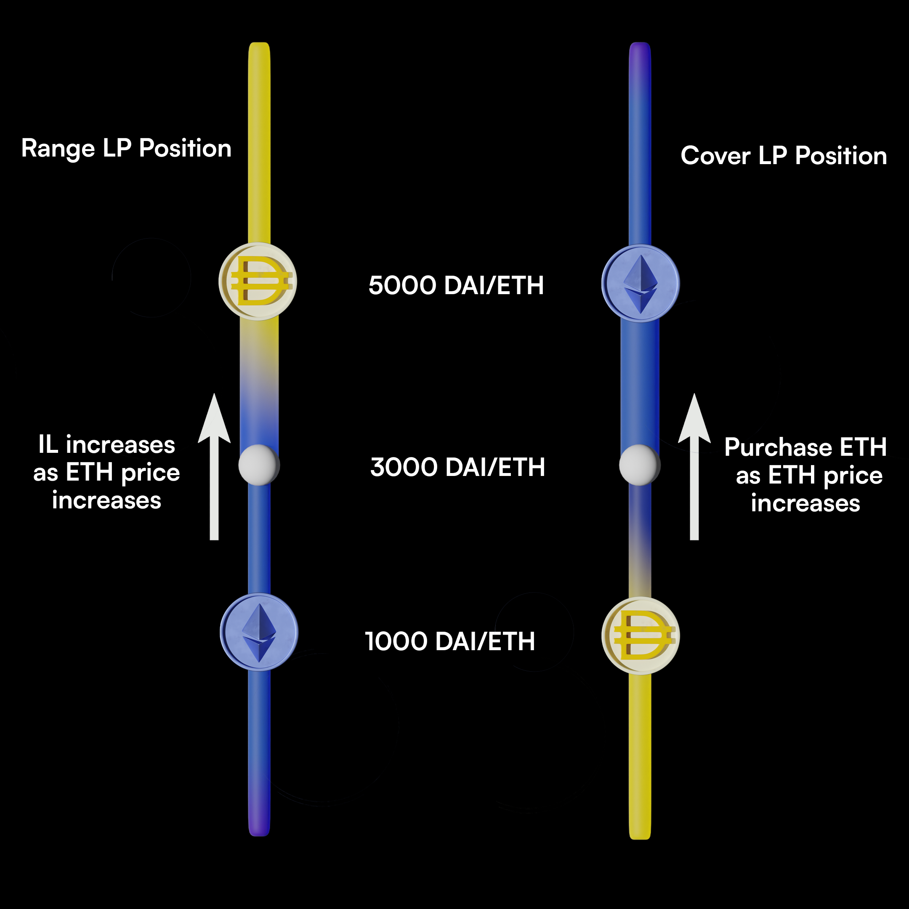
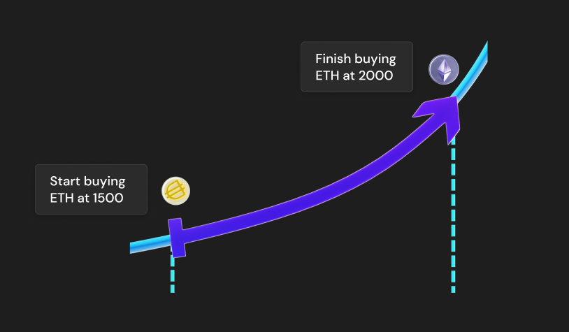

# Cover Pools
<!-- Cover Position alongside Range Position -->
Bidirectional Automated Market Makers always take the side the market desires.</br>

* If the market wants ETH, the pool takes DAI and increases the ETH to DAI price
* If the market wants DAI, the pool takes ETH and decreases the ETH to DAI price.

Cover Pools in a Directional Automated Market Maker do the opposite.</br>

* If the ETH price increases, the pool takes ETH and decreases the ETH to DAI price
* If the ETH price decreases, the pool takes DAI and increases the ETH to DAI price

{: style="width:90%"}

This allows them to function as a hedging tool if the user wants to enter or exit an `ERC-20` token over some range. 

In the case of Cover Pools, if the market price of ETH to DAI increases, liquidity will be unlocked to purchase ETH for the pool.

Directional liquidity adopts the buy-and-hold strategy, so as the price of ETH continues to rise the pool will continue to hold onto this position.

As a `Range Order`, Cover LP Positions will unlock periodically unlock as the `Time-Weighted Average Price` moves in a certain direction.

This is because we don't want the pool to buy ETH at 3000 DAI/ETH until we have a high degree of certainty 3000 DAI/ETH is the market price over some period.

### Cover Pool Use Cases

</br>
> **<em>Use Case #1: Averaging into a Position</em>**
> </br></br>
> <em>Alice wants to buy ETH from 2000 to 2200 DAI per ETH.</em>
> </br>
> <em>The current price of ETH is 1500 DAI per ETH.</em>

</br>
For this `Cover` position:

* `lower` bound would be 2000
* `upper` bound would be 2200

The user would start offering up DAI to the market when the price of ETH is at 2000.

The position would stop purchasing ETH after the prices crosses 2200 DAI per ETH.
</br></br>
> **<em>Use Case #2: Hedging Impermanent Loss</em>**
> </br></br>
> <em>Alice has an ETH/DAI LP Position on Uniswap v3.</em>
> </br>
> <em>Her range has `lower` bound 1000 and `upper` bound 5000.</em>
> </br>
> <em>The current price of ETH is 3000 DAI per ETH.</em>
> </br>
> <em>Alice wants to cover potential IL from 3000 to 5000 DAI per ETH.</em>

</br>
Assuming the user wants to cover any potential impermanent loss, this range should match their original LP position.

Capital efficiency can be improved by selecting a smaller range over which to trade to the desired output token.

Cover LP Positions can also be used to deleverage long or short positions prior to getting liquidated.

Mechanism to understand:
```
- Choosing a Range Bound
- Auctioning Unlocked Liquidity
- Claiming Position Rewards
```
## Choosing a Range Bound

### Covering Potential Impermanent Loss
<!-- add subtext below image -->
If you are seeking to cover impermanent loss dynamically as the price moves, it is ideal for your `lower` and `upper` bound to match your current position on either Uniswap v3 or Poolshark. It is okay to put the same `upper` and `lower` bound as on your original Range Position NFT. The `PoolsharkCoverPair` contract will automatically calculate how much input token you should transfer into the pool based on the currently valid price range.

If the user wants to increase capital efficiency, they can either increase the `lower` bound or decrease the `upper` bound so that less upfront capital is required.

Users cannot place liquidity along the curve at a better LP execution price than what is current. Cover pools are not meant to be used for `Take Profit` positions, as this is what the Price Pools are intended before. Rather, Cover positions are meant to slowly transition out of one asset into another as the price becomes worse for the LP. This is a way for LPs to hedge a portion of their portfolio in the case the market price moves against a token.
</br></br></br>
{: style="width:100%"}
</br></br>
### Averaging into a token
For users seeking to average into an asset starting at some price (example in the image below), they can simply set the `lower` bound as the point where they want to start transitioning from the `input` token to the `output` token. 

The Cover Pool will then use liquidity math to decide how much token to unlock at each price point based on the total amount of liquidity available in the pool for a given pair direction.


## Auctioning Unlocked Liquidity

In order to be competitive with the current market rate, the pool must have a dynamic pricing mechanism so the position is filled before the price moves too far out of range. For this, Cover Pools use the [Gradual Dutch Auction (GDA)](https://www.paradigm.xyz/2022/04/gda) mechanism to naturally raise or lower the current pool price every block based on supply demand dynamics.

From Paradigm's Gradual Dutch Auction article:
```
Here, the price for every auction decays exponentially according to some `decay constant`. The starting price of each auction increases by some fixed `scale factor`. And the starting price of the first auction is given by some `initial price`.
```

Combining these values gives us a exponentially increasing market price for each tick of liquidity we auction off. The price however should never deviate by more than one tick (e.g. 0.1% for the ETH-USDC 0.05% tier).

## Claiming Position Rewards

The way in which `directional liquidity` tracks how much of the user's position has been filled is by using the value `accumEpochLast`. That is to say that we know the highest tick at which the user got filled at based on this value. If the `accumEpochLast` of a given tick is higher than when the user minted their `Position`, we know that tick has been reached since the user's position got opened. This is the crux of how Directional Range AMMs (DAMMs) work.

<br/><br/>