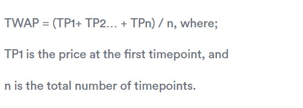

# Glossary 

## Automated Market Maker

Automated Market Makers are a type of Decentralized Exchange that employs a fixed algorithm for providing liquidity.

See more (https://www.gemini.com/cryptopedia/amm-what-are-automated-market-makers)

## Bidirectional Automated Market Maker

Bidirectional Automated Market Makers provide liquidity to a pool that facilitates trades buying/selling either token on a single trading pair at the same time through one position.

## DEX

Decentralized Exchanges (DEX) are a peer-to-peer marketplace where users can trade assets in a non-custodial manner without the need for an intermediary overseeing the custody and transfer of assets.

## Full-Range

## Limit Order Book

## Liquidity Pool

## Maker

A maker is a user who provides asset upfront to facilitate trades with takers on an exchange

## Price Priority

This is the description of a structure that prioritizes trades based off the lowest price when buying or the highest price when selling. This ensures that whether an asset is being bought or sold the party looking to market buy receives the best deal for them first.

## Taker

A taker is a user who trades with pre-existing assets provided by makers on an exchange

## Trading Pair

A trading pair is the name of the pairing of assets. Typically pairs are named asset x - asset y and the number symbolizing price is presented at amount of token x / per token y.

eg. ETH-DAI means the price of ETH in DAI

https://www.gemini.com/cryptopedia/what-are-cryptocurrency-pairs

## Tick Spacing

## Time weighted average price (TWAP)

A Time weighted average price (TWAP) is the average price a token is traded at over a period of time. Here is a common TWAP formula.

{: style="width:90%"}

A TWAP price can be viewed on-chain 

## Fee Tier

A fee tier is the percentage amount that the 
